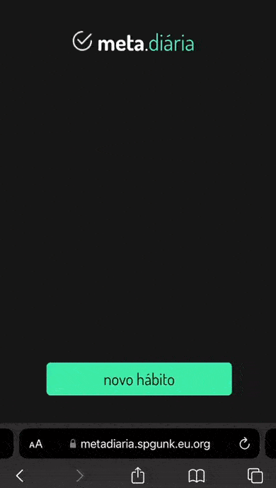

<h1 align="center"> Meta Diária</h1>

Projeto feito com back-end pra registrar seus feitos no dia a dia.. 
<a href="https://spgunk.eu.org">Meu portifolio em NextJS</a>

<strong>Demostração em telefone celular.</strong>

  <a href="#-tecnologias">Tecnologias</a>&nbsp;&nbsp;&nbsp;|&nbsp;&nbsp;&nbsp;
  <a href="#-projeto">Projeto</a>&nbsp;&nbsp;&nbsp;|&nbsp;&nbsp;&nbsp;
  <a href="#-layout">Layout</a>&nbsp;&nbsp;&nbsp;|&nbsp;&nbsp;&nbsp;
  <a href="#memo-licença">Licença</a>

  

 

## 🚀 Tecnologias

Esse projeto foi desenvolvido com as seguintes tecnologias:

- Figma
- NextJs
- NodeJs
- WebPack
- TailwindCss
- React
- KV DataBase
- TypeScript
- Git e Github

## 💻 Projeto

Projeto feito utilizando KV DataBase da Vercel..

`Para utilizar o banco de dados va na sua conta vercel e crie um deploy qualquer, feito isso entre no deploy que acabou de criar e siga o tutorial abaixo:`
 
 
**Clone o repositório no console do seu VScode:** `git clone https://github.com/hex034/MetaDiaria.git`

##

**1. Clique em Storage Depois em Create.**

**2. Clique em create.**

**3. Clique em Connect.**

**4. Clique Sobre seu "KV".**

**5. Vá em Getting Started.**

**6. Só copiar esses comando que aparecem ate a n°3.**

## Outros Projetos

- [Veja outros Principais projetos meus.](https://painelunknowbr.eu.org)

## 🔖 Layout

**Eu perdi o link do projeto do figma mais quando achar atualizarei aqui..**

---

Feito com ♥ by Hex034 :wave: [Veja outros projetos meus](https://spgunk.eu.org)